# Latex

Es multiplataforma y necesitaremos 3 cosas:

* Editor de texto
* Motor de Latex
* Visor de documentos

## Instalación

Ir a [MikTeX](https://miktex.org/dowload) y descargamos el instalador.

Tambien necesitaremos un editor de texto, ingresamos a [Texmaker](https://xm1math.net/texmaker/download.html#windows)

Existen otros editores locales como: 
* LyX
* TeXstudio
* Kile
* Bakoma-tex

Tambien tenemos online:
* sharelatex
* overleaf

Un editor en linea nos permite acceder a todos los paquetes sin instalarlos en cambio el editor local nos pedira instalar esos paquetes.


## Introducción y primeros pasos

Una limitante para aprender latex es el idioma.

[Github](https://github.com/piratax007/LaTeX_Course) Repositorio para los archivos

# Lección 1

* ¿Qué es LaTeX?
* ¿Por qué LaTeX?
* ¿Dónde adquirir LaTeX?
* Instalación local y editores en línea
* Hola mundo LaTeX - Primeros pasos

**¿Cómo funciona LaTex?**

Primeros pasos...
* Eligiendo editor
* Símbolos y caracteres especiales
* Lidiando con los errores
* Escribiendo matemáticas
* Ambientes
* Utilizando plantillas

Cómo funciona? En texto plano se escriben comandos que describen la estructura y contenido del documento.

El compilador de Latex interpreta los comandos y los convierte en un bonito documento.

> Tales elementos son llamados \emph{radioactivos}

en latex se vería:

> Tales elementos son llamados *radioactivos*


Latex es un lenguaje de computadora basado en etiquetas igual que HTML

Codigo de latex consiste en cofigurar la estructura y contenido del documento, basicamente un documento en latex tendría:

* Determinar la estructura del documento
* Determinar el contenido del documento

Documento básico en LaTeX
```tex
\documentclass{article} %preámbulo
\usepackage[utf8]{inputenc}
\usepackage[spanish]{babel}

\begin{document} %Documento
    Hola Mundo!
\end{document}
```
* Los comandos inician con backslash `\`
* Cada documento inicia con el comando `\documentclass`, el argumento entre llaves `{}` indica la clase de documento que se esta creando.
* Los comentarios inician con el carácter porcentaje `%`

## Símbolos y caracteres especiales

* Uso de comillas
  * Comillas simples `texto' produce 'texto'
  * Comillas dobles ``texto'' produce "texto"
* Algunos caracteres especiales
  * `%` comentarios
  * `#` argumentos de entrada
  * `&` separador de tabulaciones
  * `%` matemáticas en línea
* Para escribir alguno de estos caracteres especiales debe anteceder un `\`, e.g `\$` produce `$`

## Lidiando con los errores

LaTeX puede confundirse cuando intenta compilar el documento. Si esto pasa, se detendrá la compilación indicando que existe un error que deberá corregirse antes de que se obtengan resultados.

Ante los errores...
1. No se preocupe, es normal que existan errores
2. Repase minuciosamente el código, muchas veces los errores esta en los detalles
3. Pregunte, el soporte de la comunidad es invaluable

## Ejercicios
1. Hola mundo en latex

```tex
\documentclass{article} %preámbulo
\usepackage[utf8]{inputenc} % paquete de codificacion
\usepackage[spanish]{babel} % indicar que el documento esta en spanish
\begin{document} %Documento
    `Hola Mundo'
    ``Hola MUNDO''
\end{document}
```
Resultado
```
 ‘Hola Mundo’ “Hola MUNDO”
```
2. Escriba esto en un documento LaTeX

El principal grupo en ese momento correspondía al que desde los años setenta fue "bautizado" como grupo Suramericana, y que algunos llamaban el Sindicato Antioqueño y otros el Grupo Empresarial Antioqueño, con unos activos equivalentes al 15.7% del PIB, unos $11.500 millones de dólares estadounidenses, cuando en los años setenta ocupaba el cuarto puesto, con activos equivalentes al 7.3% del PIB; es decir, más que duplicó su peso relativo.

```tex
\documentclass{article} %preámbulo
\usepackage[utf8]{inputenc} % paquete de codificacion
\usepackage[spanish]{babel} % indicar que el documento esta en spanish
\begin{document} %Documento
El principal grupo en ese momento correspondía al que desde los años setenta fue ``bautizado'' como grupo Suramericana, y que algunos llamaban el Sindicato Antioqueño y otros el Grupo Empresarial Antioqueño, con unos activos equivalentes al 15.7\% del PIB, unos \$11.500 millones de dólares estadounidenses, cuando en los años setenta ocupaba el cuarto puesto, con activos equivalentes al 7.3\% del PIB; es decir, más que duplicó su peso relativo.
\end{document}
```
resultado
```
El principal grupo en ese momento correspondía al que desde los años setenta fue “bautizado” como grupo Suramericana, y que algunos llamaban el Sindicato Antioqueño y otros el Grupo Empresarial Antioqueño, con unos activos equivalentes al 15.7% del PIB, unos $11.500 millones de dólares estadounidenses,cuando en los años setenta ocupaba el cuarto puesto, con activos equivalentes al 7.3% del PIB; es decir, más que duplicó su peso relativo.
```

# Escribiendo Matemáticas
## El signo `$`

¿Por qué es especial el signo `$`? Porque se utiliza para describir matemáticas dentro de una línea de texto.

```tex
% NO luce bien: 
Sean a y b dos enteros positivos diferentes, entonces c = a - b + 1

% Luce bien: 
Sean $a$ y $b$ dos enteros positivos diferentes, entonces $c = a - b + 1$
```

Utilice siempre el signo `$`, uno al inicio y otro al final de la expresión matemática.

LaTeX ignora automáticamente los espacios.
```text
% Son iguales LaTeX le da los espacios automaticamente
Sea $y=mx+b$ entonces \ldots
Sea $y = mx + b$ entonces \ldots
```

## Superindices, subindices, corchetes

Utilice `^` para superindices y `_` para subíndices.

Utilice corchetes `{ }` para escribir superíndices o subíndices grandes.
```tex
$a_n = a_n-1 + a_n-2$ % error
$a_n = a_{n-1} + a_{n-2}$ % correcto

$f(x) = e^ax + b + c$ % error
$f(x) = e^{ax + b} + c$ % correcto

El último término es: $b^n = _nC_nb^n$
```

Existen comandos para las letras griegas y la notación común
```tex
$P(z)=\alpha + \lambda(z - \alpha)^n$
$\iint_Sdxdy = \iiint_{H(S)}dxdy$
```

# Ambientes
Listas

Los comandos `begin` y `end` habilitan el uso de ambientes que son espacios de trabajo "especiales" de un documento.
```tex
% Lista con viñetas
\begin{itemize}
    \item Le\'on
    \item Tigre
    \item \dots
\end{itemize}

% Listas enumeradas
\begin{enumerate}
    \item Criollo
    \item Angora
    \item \dots
\end{enumerate}
```

# Utilizando plantillas

Las plantillas son documentos preformateados en los que basicamente se modifica el contenido, ideales para documentos rápidos y repetitivos

Una plantilla se compone (generalmente) de los archivos de estilo .sty y la fuente del documento .tex

Existen muchos repositorios de plantillas LaTeX, la mayoría de ellos en inglés.


Actividad.-
Utilizando la plantilla para cartas disponible en Overleaf o en github escriba una carta que contenga ecuaciones en línea y caracteres especiales como comillas, símbolos de dolar, porcentajes, etc.

Un ejemplo del uso de la plantilla esta en https://github.com/piratax007/LaTeX_Course/tree/master/plantillas


> Averiguar como instalar diccionarios en vscode
> Las plantillas se pueden instalar de forma global

> El trabajo mas dificil al momento de usar latex es definir la estructura del documento, por eso lo recomendable es aprender a manejar las plantillas para que podamos crearlas o simplemente saber editarlas y asi poder centrarnos en el contenido, lo malo es que el principal repositorio de plantillas esta en ingles

> Nostros podemos publicar nuestra propia plantilla


# Lección 2

* Documentación y ayuda
* Estructura general de un documento LaTeX
* Uso de columnas
  * Los comandos `twocolumn` y `onecolumn`
  * El paquete `multicolumn`
  * El paquete `paracol`

¿Dónde adquirir LaTeX?
* Documentacion oficial https://www.latex-project.org/
* Repositorio de paquetes http://www.ctan.org
* ¿Dónde conseguir ayuda?
  * En ingles la documentacion y comunidades de ayuda son abundantes
    * https://overleaf.com/latex/templates Repositorio de plantillas LaTeX
    * https://en.wikibooks.org/wiki/latex muy completo
    * https://es.sharelatex.com/learn Pagina de aprendizaje de LaTeX de sharelatex
    * https://tex.stackexchange.com/ comunidad principal de latex
  * En español son escasos los recursos, sin embargo los hay muy buenos
    * http://minisconlatex.blogspot.com.co/ Blog dedicado a latex
    * https://es.wikibooks.org/wiki/manual_de_latex aunque incompleta es la traduccion del wikibook de latex
    * https://overleaf.com/gallery/tagged/spanish#.WSCyXLNAlQK Repositorio de plantillas de latex

Estructura general de un documento LaTeX
* Distribución del documento en columnas

# Estructura general de un documentos en LaTeX

Un documento básico
* Los comandos (en el preámbulo) `\title`, `\author`, `\date` definen el encabezado de presentación del documento.
* El comando `\maketitle` despues de `\begin{document}` crea el contenido del encabezado
* Utilice el ambiente `\abstract` para definir el resumen
* Utilice `\section`, `\subsection`, `\subsubsection` o `\paragraph` para definir las diversas partes del documento ¿Qué pasa cuando estos comandos se siguen de un *? e.g. `\section*{}`. Rpta: Pierde la numeración

> El paragraph es un título que no lleva numeración, se usaría despues del \subsubsection

```tex
\documentclass{article}
\usepackage[utf8]{inputenc}
\usepackage[spanish]{babel}
\usepackage{amsmath} % presentacion de ecuaciones
\usepackage{lipsum} % generador de contenido lorem ipsum

\title{Título del artículo}
\author{Juan Diego Poccori Escalante}
\date{\today} %fecha actual

\begin{document}
    \maketitle %muestra el title author y date en el documento
    \begin{abstract} %resumen
        \lipsum[2]
    \end{abstract}

    % en un documentclass de tipo article tenemos section subsection pero no capitulo
    \section{Verdadera sección 1}
        \lipsum[5]
        \subsection{Subseccion 1}
            \lipsum[5]
            \subsubsection{Subsubsección 1}
                \lipsum[1]
    \section{Título de la sección 1}
    \section*{Título de la sección 2}
        \lipsum[1]
    \paragraph{Otro título}
        \lipsum[7]

\end{document}
```

# Distribución del documento en columnas
* Comandos `\twocolumns` y `\onecolumn`. Estos comandos modifican la distribucion del texto a una o dos columnas, cada espacio en una nueva página
* El paquete `multicolumn`. Este ambiente genera un ambiente de distribución en columnas sin crear una página nueva, la observación es que no permite utilizar elementos flotantes tales como figuras.
* El paquete `paracol`. Permite sincronizar columnas e incluir elementos flotantes

> los comandos twocolumn y onecolumn no son muy atractivos para trabajar con ellos por que crean nuevas páginas dejando en blanco las anteriores paginas.

```tex
\documentclass{article}
\usepackage[utf8]{inputenc}
\usepackage[spanish]{babel}
\usepackage{amsmath} % presentacion de ecuaciones
\usepackage{lipsum} % generador de contenido lorem ipsum

\title{Título del artículo}
\author{Juan Diego Poccori Escalante}
\date{\today} %fecha actual

\begin{document}
    \maketitle %muestra el title author y date en el documento
    \begin{abstract} %resumen
        \lipsum[2]
    \end{abstract}

    \twocolumn
    \lipsum[1-3]
    
    \onecolumn
    \lipsum[2]

\end{document}
```

Entonces hay un paquete que viene instalado en cualquier distribucion de latex `multicolumn` que nos permitira generar 1,2,3,... columnas sin que se generen nuevas paginas, el unico inconveniente con este es que no podemos insertar elementos flotantes como por ejemplo una figura que aparezca centrada con caption o un cuadro.

```tex
\documentclass{article}
\usepackage[utf8]{inputenc}
\usepackage[spanish]{babel}
\usepackage{amsmath} % presentacion de ecuaciones
\usepackage{lipsum} % generador de contenido lorem ipsum
\usepackage{multicol}

\title{Título del artículo}
\author{Juan Diego Poccori Escalante}
\date{\today} %fecha actual

\begin{document}
    \maketitle %muestra el title author y date en el documento
    \begin{abstract} %resumen
        \lipsum[2]
    \end{abstract}

    % Configuraciones
    \renewcommand{\columnseprule}{5pt}
    % \setlenght\columnsep{5mm}
    % ambiente multicol
    \begin{multicols}{3}
        \lipsum[1-3]
    \end{multicols}

\end{document}
```

Sin embargo hay un paquete que es mucho más potente para a distribucion en columnas que es el paquete `paracol`, paracol nos permite administrar cada columna sincronizarlos.

```tex
\documentclass{article}
\usepackage[utf8]{inputenc}
\usepackage[spanish]{babel}
\usepackage{amsmath} % presentacion de ecuaciones
\usepackage{lipsum} % generador de contenido lorem ipsum
\usepackage{paracol} % usar paquete paracol
\usepackage{xcolor}

\title{Título del artículo}
\author{Juan Diego Poccori Escalante}
\date{\today} %fecha actual

\begin{document}
    \maketitle %muestra el title author y date en el documento
    \begin{abstract} %resumen
        \lipsum[2]
    \end{abstract}

    \begin{paracol}{2}[\section{Sección de título largo}]
        \lipsum[2]
        \switchcolumn
        Esta es la traduccion de la sección uno
        \switchcolumn* % volver a la primera columna
        \lipsum[2]
        % sincronizar con la columna 1
        \switchcolumn
        \lipsum[2]
    \end{paracol}

    % Columnas distribuidas de forma diversa

    \subsection{Columnas dispares}
    % dar 60% a la columna
    \columnratio{.6}
    \columncolor{red} %darle color a una columna instalamos paquete xcolor
    \begin{paracol}{2}
        \lipsum[5]
        \switchcolumn
        \lipsum[6]
        \textcolor{blue}{Este puede ser cualquier texto}
    \end{paracol}

\end{document}
```

# Leccion 3 Escribiendo Matemáticas

* Modo matemático
  * Fracciones
  * Paréntesis y signos de agrupación
  * Matrices
  * Alineación de ecuaciones
* El comando `newtheorem`

## Modo matemático

Las ecuaciones en LaTeX pueden presentarse ajustadas al espacio de la línea de texto `$\sum_{i=1}^na_i$` o bien que el espacio del texto se ajuste a la ecuación `$\displaystyle{\sum_{i=1}^na_i}$` 

El modo `display` puede desplegarse en un espacio único para la ecuación mediante `\ [ \ ]` o bien mediante el ambiente `\equation` 

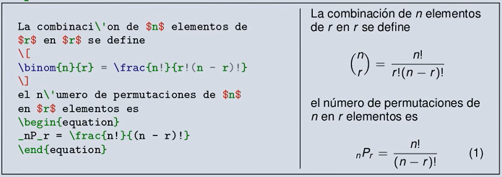

[Compendio con mas de 14000 signos en latex](https://archive.org/stream/symbols-a4#mode/2up)

```tex
\documentclass{article}
\usepackage[utf8]{inputenc}
\usepackage[spanish]{babel}
\usepackage{amsmath} % presentacion de ecuaciones

\title{Matemáticas}
\author{Juan Diego Poccori Escalante}
\date{\today} %fecha actual

\begin{document}
    \maketitle %muestra el title author y date en el documento

    % display dedicado, centra la ecuacion y no la enumera
    La combinaci\'on de $n$ elementos de $r$ en $r$ se define:
    \[
    \binom{n}{r} = \frac{n!}{r!(n-r)!}
    \]

    % display dedicado, centra la ecuacion y la enumera
    el número de permutaciones de $n$ en $r$ elementos es
    \begin{equation}
        _nP_r = \frac{n!}{(n-r)!}
    \end{equation} 
    
    % display dedicado, centra la ecuacion y NO la enumera
    el número de permutaciones de $n$ en $r$ elementos es
    \begin{equation*}
        _nP_r = \frac{n!}{(n-r)!}
    \end{equation*} 

    % En linea
    Una ecuación en línea se presenta de la forma $y'' + p(x)y' + q(x)y = g(x)$, un ejemplo más $\int_a^bf(x)dx$ 
    
    % displaystyle
    Una ecuación en línea se presenta de la forma $y'' + p(x)y' + q(x)y = g(x)$, un ejemplo más $\displaystyle{\int_a^bf(x)dx}$ 


\end{document}
```

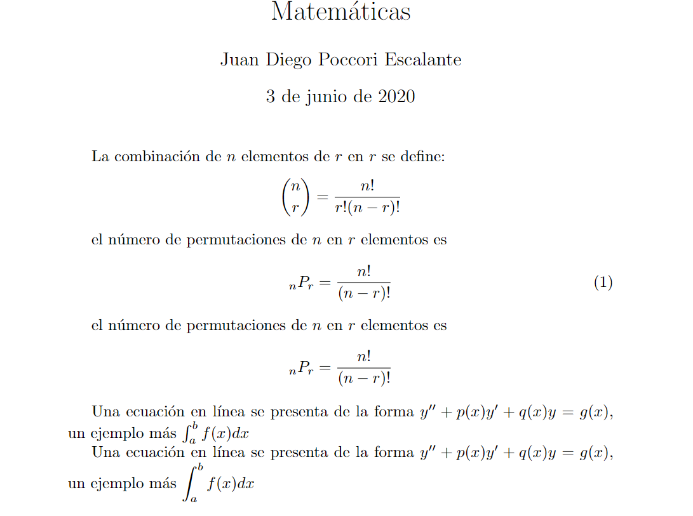

## Fracciones

La escritura de fracciones puede hacerse en tres modos `\frac` (automático), `\tfrac` (tamaño texto), y `\dfrac` (tamaño display)

```tex
\documentclass{article}
\usepackage[utf8]{inputenc}
\usepackage[spanish]{babel}
\usepackage{amsmath} % presentacion de ecuaciones

\begin{document}
    Una fracción ajustada al texto $\tfrac{1}{x+2}$ y una en modo display $\dfrac{1}{x+2}$ se presentan de diferente tamaño.
\end{document}
```
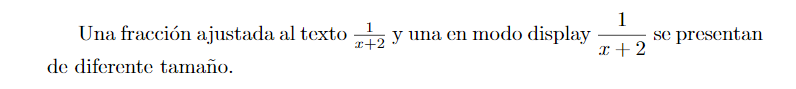

Para la escritura de fracciones continuas lo mejor es utilizar el comando `\cfrac`

```tex
\documentclass{article}
\usepackage[utf8]{inputenc}
\usepackage[spanish]{babel}
\usepackage{amsmath} % presentacion de ecuaciones

\begin{document}
    $\pi$ expresado como una fracción continua
    \[
    \pi = \cfrac{4}{1+\cfrac{1}{3^2+\ddots}}
    \]
\end{document}
```
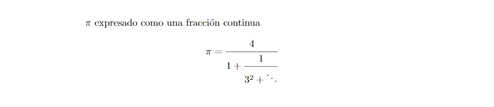

## Paréntesis y signos de agrupación

Los principales signos de agrupación pueden obtenerse con:
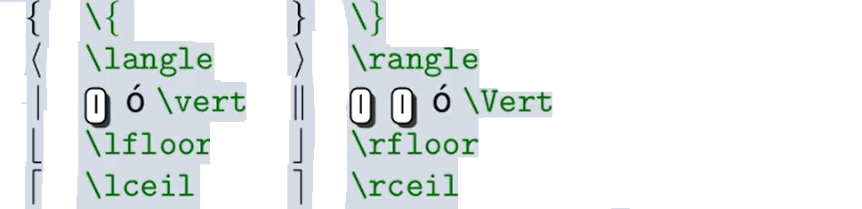

El tamaño de parentesis y signos de agrupación puede ajustarse de acuerdo al contenido anteponiendo al signo la instrucción `\right` o `\left`.

En algunas ocasiones el uso de \left y \right no es suficiente para ajustar los signos de agrupación a su contenido, puede utilizarse entonces `\bigl`, `\bigr` `\Bigl`, `\Bigr`, `\biggl`, `\biggr`, `\Bibbl`, `\Biggr`

```tex
\documentclass{article}
\usepackage[utf8]{inputenc}
\usepackage[spanish]{babel}
\usepackage{amsmath} % presentacion de ecuaciones

\begin{document}
    \[
    \frac{d}{dx}(\frac{dx}{dy})
    \]
    % para solucionar el error usamos left y right asi los parentesis cubriran toda la expresión
    \[
    \frac{d}{dx}\left(\frac{dx}{dy}\right)
    \]
\end{document}
```

## Matrices

Existen diferentes ambientes para matrices de acuerdo al tipo de parentesis que la contenga.
* `matrix` Sin parentesis
* `pmatrix` ( )
* `vmatrix` | |
* `Bmatrix` { }
* `bmatrix` [ ]
* `Vmatrix` || ||

En cualquiera de los ambientes `matrix`, los caracteres `&` y `\` `\` se utilizan para alternar entre columnas y filas respectivamente.
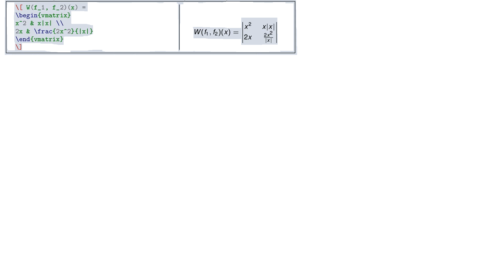

El ambiente `array` permite alinear por separado cada columna de una matriz
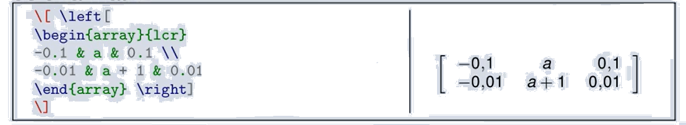

```tex
\documentclass{article}
\usepackage[utf8]{inputenc}
\usepackage[spanish]{babel}
\usepackage{amsmath} % presentacion de ecuaciones

\begin{document}
    \[
    \begin{vmatrix}
        a_{11} & a_{12} & a_{13} \\
        a_{21} & a_{22} & a_{23} \\
        a_{31} & a_{32} & a_{33} 
    \end{vmatrix}
    \]
    % Podemos usar \begin{matrix}{lcr} que ordenaria la primera columna left la segunda center y la tercera right
\end{document}
```

## Alineación de ecuaciones

El ambiente `split` permite escribir ecuaciones de varias líneas alineadas por un caracter
```language
\documentclass{article}
\usepackage[utf8]{inputenc}
\usepackage[spanish]{babel}
\usepackage{amsmath} % presentacion de ecuaciones

\begin{document}
    %alinear atraves del caracter =
    %no nos enumera las ecuaciones
    \[
    \begin{split}
        3x + 6 &= 18 \cdots \\
        3x &= 12 \cdots \\
        x &= 4 \cdots
    \end{split}    
    \]
\end{document}
```
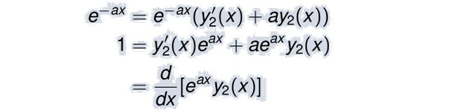

El ambiente `multiline` permite "partir" una ecuacion en varias líneas tambien con ayuda de los `\\` para partir
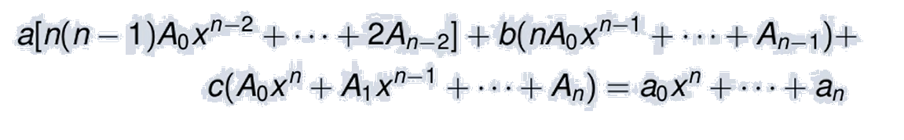

El ambiente `gather` escribe un bloque de ecuaciones sin alineación donde cada región aparecenumerado como una ecuación diferente; usando `\notag` puede eliminarse la numeración de un renglón específico.
```text
\documentclass{article}
\usepackage[utf8]{inputenc}
\usepackage[spanish]{babel}
\usepackage{amsmath} % presentacion de ecuaciones

\begin{document}
    Ejemplo de uso del comando \texttt{gather}
    \begin{gather}
        3x + 6 = 18 \\
        3x = 18 - 6 \\
        \notag 3x = 12 \\ 
        x = \frac{12}{3} \\
        x = 4
    \end{gather}
\end{document}
```
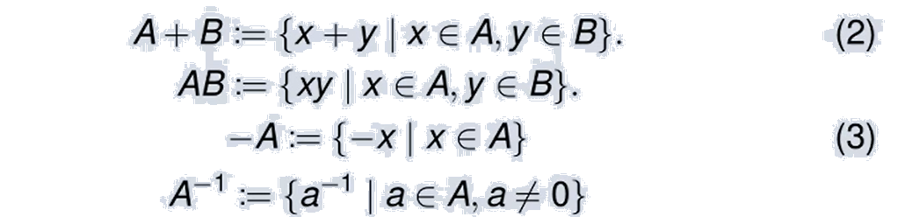

El ambiente `align` funciona tal como `split` con la característica que permite alinear varias columnas de ecuaciones
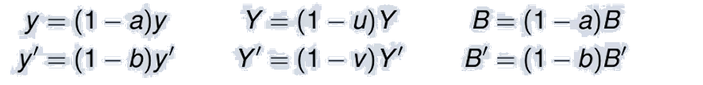

## El comando newtheorem
La aparición de Teoremas, demostraciones, definiciones, etc. es muy frecuente en documentos de contenido matemático, el comando `\newtheorem` (en el preámbulo) permite definir nuevos ambientes para estos casos.

La sintaxis del comando `\newtheorem` es simple `\newtheorem{nombre}{título}`

```tex
\documentclass{article}
\usepackage[utf8]{inputenc}
\usepackage[spanish]{babel}
\usepackage{amsmath} % presentacion de ecuaciones

\newtheorem{mydef}{Definición} %definimos el nombre mydef

\begin{document}
    \begin{mydef}[Ejemplo de Definición]
        Mi teorema 1
    \end{mydef}
\end{document}
```

# Lección 4: Tomando el control de LaTeX
Medianamente avanzado, definicion de nuevos comandos y nuevos ambientes
* Definiendo colores
  * El paquete xcolor
* Definiendo nuevos comandos
  * El comando newcommand
* Definiendo nuevos ambientes
  * El comando newtheorem
  * El comando newenvironment
* Organizando el código con el comando input

## Definiendo Colores

Definir nuestra propia paleta de colores

* El paquete `xcolor` permite utilizar una enorme cantidad de colores por nombre predefinido o definir sus propios colores
```tex
\usepackage[model_names]{xcolor}
```

`usenames` - 16 colores, `divpsnames` - 68 colores, `svgnames` - 150 colores, `x11names` - 300 colores

* Definir nuevos colores es muy fácil

```tex
\definecolor[nombre]{modelo}{color}
```
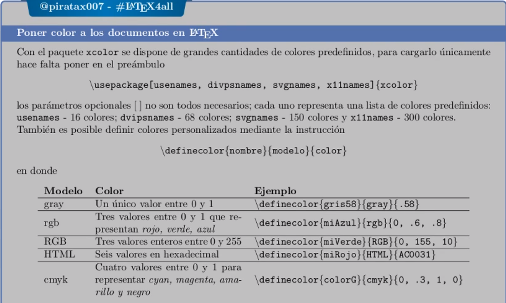

```tex
\documentclass{article}
\usepackage[utf8]{inputenc}
\usepackage[spanish]{babel}
\usepackage{amsmath}
\usepackage{amsfonts}
\usepackage{amssymb}
\usepackage{lipsum}

\usepackage{xcolor} % Importar el paquete xcolor

% Definir mi paleta de colores
\definecolor{myGreen}{HTML}{36A736}

\title{Tomando el control de \LaTeX}
\author{Juan Diego Poccori Escalante}
\date{\today}

\begin{document}
    \maketitle
    \textcolor{myGreen}{Un texto en color verde}
\end{document}
```

Crear una paleta de colores.
1. Creamos un nuevo archivo en el directorio por ejemplo `paletaColores.tex`
```tex
%archivo paletaColores.tex
\usepackage{xcolor} % Importar el paquete xcolor

% Definir mi paleta de colores
\definecolor{myGreen}{HTML}{36A736}
\definecolor{myBlue}{HTML}{02528F}
\definecolor{myOrange}{HTML}{FF4312}
```
2. Importamos el archivo `paletaColores.tex` con el comando `\input`
```tex
\documentclass{article}
\usepackage[utf8]{inputenc}
\usepackage[spanish]{babel}
\usepackage{amsmath}
\usepackage{amsfonts}
\usepackage{amssymb}
\usepackage{lipsum}

% Importar paleta de colores
\input{paletaColores.tex}

\title{Tomando el control de \LaTeX}
\author{Juan Diego Poccori Escalante}
\date{\today}

\begin{document}
    \maketitle
    \textcolor{myGreen}{Un texto en color verde}
    \textcolor{myBlue}{Un texto en color azul}
    \textcolor{myOrange}{Un texto en color naranja}
\end{document}
```

## Definir nuevos comandos
* El comando \newcommand (en el preámbulo) define nuevos comandos.
```tex
\newcommand{\nombre}[parámetros]{definición}
```
* Los parámetros de entrada (máximo 9) no son obligatorios, si no se declaran
* El nombre de comando nuevo no puede tener dígitos
* LaTeX no permite comandos con el mismo nombre, el comando `\renewcommand` permite cambiar la definición de un comando ya existente.
* El primer parámetro (únicamente) de nuevo comando puede tener un valor predefinido y opcional
```tex
\newcommand{\nombre}[#P][predefinido]{definicion}
```
* La declaración de comandos nuevos algunas veces puede fallar en algunos ambientes, en este caso puede utilizar `\DeclareRobustCommand...` en lugar de `\newcommand`

```tex
\documentclass{article}
\usepackage[utf8]{inputenc}
\usepackage[spanish]{babel}
\usepackage{amsmath}
\usepackage{amsfonts}
\usepackage{amssymb}
\usepackage{lipsum}

% Importar paleta de colores
\input{paletaColores.tex}


\newcommand{\cuadratica}{
    \begin{equation}
        x_{1,2} = \frac{1}{2}\Bigl(\frac{-b\pm\sqrt{b^2-4ac}}{a}\Bigr)
    \end{equation}
}

\title{Tomando el control de \LaTeX}
\author{Juan Diego Poccori Escalante}
\date{\today}

\begin{document}
    \maketitle
    \textcolor{myGreen}{Un texto en color verde}
    \textcolor{myBlue}{Un texto en color azul}
    \textcolor{myOrange}{Un texto en color naranja}
    % Usamos el commando que creamos
    \cuadratica{}
\end{document}
```
Tambien podemos crear un nuevo archivo y tener ahi todos los nuevos comandos que cree y luego imoortarlo con el input
```tex
\usepackage{xstring} % Paquete necesario para cargar condicionales en newcommand

\newcommand{\Fourier}[1][eq]{
	\IfEqCase {#1}{
		{eq}{
			\begin{equation}
				\hat{f}(\xi) = \int_{-\infty}^{\infty}f(x)e^{-2\pi ix\xi}dx
			\end{equation}
		}
		{disp}{
			\[
				\hat{f}(\xi) = \int_{-\infty}^{\infty}f(x)e^{-2\pi ix\xi}dx
			\]
		}
		{inLine}{
			$\hat{f}(\xi) = \int_{-\infty}^{\infty}f(x)e^{-2\pi ix\xi}dx$
		}
	}
}

\newcommand{\Wave}{
\begin{equation}
	\frac{\partial ^2u}{\partial t^2} = c^2\frac{\partial ^2u}{\partial x^2}
\end{equation}
}

\newcommand{\Maxwell}{
	\begin{align*}
		\nabla \cdot E &= 0 & \nabla \times E &= -\frac{1}{c}\frac{\partial H}{\partial t} \\
		\vspace{5pt} \\
		\nabla \cdot H &= 0 & \nabla \times H &= \frac{1}{c}\frac{\partial E}{\partial t}
	\end{align*}
}

\newcommand{\Schrodinger}{
	\begin{equation}
		i\hbar \frac{\partial}{\partial t}\psi = \hat{H}\psi
	\end{equation}
}
```
Si queremos aceptar mas de dos parametro en el condicional usamos:
```tex
\documentclass{article}
\usepackage[utf8]{inputenc}
\usepackage[spanish]{babel}
\usepackage{amsmath}
\usepackage{amsfonts}
\usepackage{amssymb}
\usepackage{lipsum}
\usepackage{xstring} % Paquete necesario para cargar condicionales en newcommand

% Importar paleta de colores
\input{paletaColores.tex}


\newcommand{\cuadratica}{
    \begin{equation}
        x_{1,2} = \frac{1}{2}\Bigl(\frac{-b\pm\sqrt{b^2-4ac}}{a}\Bigr)
    \end{equation}
}

\newcommand{\Fourier}[2][eq, color]{
	\IfEqCase {#1}{
		{eq}{
			\begin{equation}
				\textcolor{#2}{\hat{f}(\xi) = \int_{-\infty}^{\infty}f(x)e^{-2\pi ix\xi}dx}
			\end{equation}
		}
		{disp}{
			\[
				\hat{f}(\xi) = \int_{-\infty}^{\infty}f(x)e^{-2\pi ix\xi}dx
			\]
		}
		{inLine}{
			$\hat{f}(\xi) = \int_{-\infty}^{\infty}f(x)e^{-2\pi ix\xi}dx$
		}
	}
}

\title{Tomando el control de \LaTeX}
\author{Juan Diego Poccori Escalante}
\date{\today}

\begin{document}
    \maketitle
    \textcolor{myGreen}{Un texto en color verde}
    \textcolor{myBlue}{Un texto en color azul}
    \textcolor{myOrange}{Un texto en color naranja}
    % Usamos el commando que creamos
    \cuadratica{}
    \Fourier[eq]{myOrange}
    
    \Fourier[eq]{myBlue}
\end{document}
```

## Definir nuevos ambientes

El comando `\newtheorem` permite definir ambientes nuevos que pueden estar numerados de forma continua en todo el documento o por secciones.
```tex
\newtheorem{nombre}{título}{numeración}
```
Ejemplo
```tex
\documentclass{article}
\usepackage[utf8]{inputenc}
\usepackage[spanish]{babel}
\usepackage{amsmath}
\usepackage{amsfonts}
\usepackage{amssymb}
\usepackage{lipsum}
\usepackage{xstring} % Paquete necesario para cargar condicionales en newcommand

% Importar paleta de colores
\input{paletaColores.tex}

\newtheorem{definicion}{Definición}
\newtheorem{observacion}{Observación}[section]

\title{Tomando el control de \LaTeX}
\author{Juan Diego Poccori Escalante}
\date{\today}

\begin{document}

    \section[]{Sección 1}
    \lipsum[2]

    \begin{definicion}
        \lipsum[1]
    \end{definicion}
    %Observación 1.1
    \begin{observacion}
        Esta es una observacion
    \end{observacion}

    \section[]{Sección 2}
    \lipsum[2]

    \begin{definicion}
        \lipsum[1]
    \end{definicion}
    %observación 2.1
    \begin{observacion}
        Esta es una observacion
    \end{observacion}

\end{document}
```

* Creando un ambiente con `newenvironment` se puede definir ambientes no numerados
```tex
\newenvironment{nombre}[parametros]
{instrucciones anteriores}
{instrucciones posteriores}
```

1. Creamos un archivo cajas.tex
```tex
\usepackage{tcolorbox}

\newtheorem{definition}{Definición}

\newtheorem{ejemplo}{Ejemplo}[section]

\newenvironment{remark}[1]
{
	\begin{tcolorbox}[colback = myBlue!25, colframe = blue254!75, title=#1, arc = 3mm, sharp corners = northwest]
	\fontfamily{qag}\selectfont
}
{
	\end{tcolorbox}
}
```
2. importamos en el main y ejecutamos
```tex
\documentclass{article}
\usepackage[utf8]{inputenc}
\usepackage[spanish]{babel}
\usepackage{amsmath}
\usepackage{amsfonts}
\usepackage{amssymb}
\usepackage{lipsum}
\usepackage{xstring} % Paquete necesario para cargar condicionales en newcommand

% Importar paleta de colores
\input{paletaColores.tex}
\input{cajas.tex}

\title{Tomando el control de \LaTeX}
\author{Juan Diego Poccori Escalante}
\date{\today}

\begin{document}

    %Dibujando cajas
    \begin{remark}{Nota Importante}
        Nota para no olvidar en una caja bonita
    \end{remark}

\end{document}
```

# Leccion 5 Figuras y Tablas

* Configurar margenes con vmargin
* Configurar tabla de contenido y lista de figuras y tablas
* Administrar figuras
  * Incluir imágenes
  * El ambiente wrapfig
  * El ambiente subfigure
* Construir tablas
  * Agregar color
  * Combinar celdas

Definiendo nuestro espacio de trabajo usando `vmargin` que nos permitirá editar el tamaño de nuestro documento asi como sus márgenes
```tex
\documentclass{article}
\usepackage[utf8]{inputenc}
\usepackage[spanish]{babel}
\usepackage{amsmath}
\usepackage{amsfonts}
\usepackage{amssymb}
\usepackage{lipsum}
\usepackage{xstring} % Paquete necesario para cargar condicionales en newcommand
\usepackage{graphics} % Paquete necesario que nos permite trabajar con imágenes
\usepackage{vmargin} % Definir los margenes del documento

\setpapersize{A4}
\setmargins{2.5cm} % margen izquierdo
{1.5cm} % margen superior
{16.5cm} % ancho del area de impresion
{23.42cm} % longitud del area de impresion
{0pt} % espacio para el encabezado
{5mm} % espacio entre el encabezado y el texto
{0pt} % espacio para el pie de pagina
{5mm} % espacio entre el texto y el pie de pagina

% Importar paleta de colores
\input{paletaColores.tex}

\title{Ejemplo de uso de Imágenes y Texto en \LaTeX}
\author{Juan Diego Poccori Escalante}
\date{\today}

\begin{document}
    \maketitle

    \renewcommand{\contentsname}{Tabla de contenido}
    \tableofcontents
    
\end{document}
```

## Objetos flotantes

Incluir figuras
* El paquete `wrapfigure`
* El paquete `subcaption`

Construir tablas
* El ambiente `tabular`

Ubicacion de una figura y crear una tabla

Un objeto tal como una figura o tabla debe aparecer lo más próximo al texto que hace referencia a él, sin embargo, al agregar cambios en el documento, los ojetos pueden desplazarse de manera inadecuada. LaTeX resuelve el problema manipulando figuras y tablas como objetos flotantes
```tex
\begin{figure}[ubicación]
...
\end{figure}

\begin{table}[ubicación]
...
\end{table}
```
* La ubicación puede ser `t` (top), `b` (bottom), `h` (here)
* Los comandos `\tablename` y `\figurename` redefinidos dentro del documento modifican el encabezado del caption de tablas y figuras respectivamente.

## Incluir figuras

* El paquete `graphicx` es necesario para incluir archivos de imágenes en documentos LaTeX
* El comando `\includegraphics` carga una imagen de formato svg, png, eps, jpg, pdf, etc. en el documento
* Para definir la direccion de ubicación común para todas las imágenes puede utilizarse el comando `\graphicspath{{./direccion/}}`

```tex
\documentclass{article}
\usepackage[utf8]{inputenc}
\usepackage[spanish]{babel}
\usepackage{amsmath}
\usepackage{amsfonts}
\usepackage{amssymb}
\usepackage{lipsum}
\usepackage{xstring} % Paquete necesario para cargar condicionales en newcommand
\usepackage{graphicx} % Paquete necesario que nos permite trabajar con imágenes
\usepackage{vmargin} % Definir los margenes del documento

\setpapersize{A4}
\setmargins{2.5cm} % margen izquierdo
{1.5cm} % margen superior
{16.5cm} % ancho del area de impresion
{23.42cm} % longitud del area de impresion
{0pt} % espacio para el encabezado
{5mm} % espacio entre el encabezado y el texto
{0pt} % espacio para el pie de pagina
{5mm} % espacio entre el texto y el pie de pagina

% indicamos la direccion donde tenemos nuestras imagenes
\graphicspath{{./images/}}

% Importar paleta de colores
\input{paletaColores.tex}

\title{Ejemplo de uso de Imágenes y Texto en \LaTeX}
\author{Juan Diego Poccori Escalante}
\date{\today}

\begin{document}
    \maketitle
    \renewcommand{\contentsname}{Tabla de contenido}
    \renewcommand{\listfigurename}{Lista de Figuras}
    \renewcommand{\figurename}{Fig.}
    \tableofcontents
    \listoffigures

    \section{Incluir imágenes y figuras}
    El ambiente figure permite definir un objeto flotante que corresponde a imágenes

    \begin{figure}[ht]
        \centering
        % Una vez importado el path de nuestras imagenes con \graphicspath solo teenemos que escribir el nombre del archivo
        \includegraphics[scale=0.5]{cubo}
        % \includegraphics[scale=0.5]{images/cubo.png}
        \caption{Fotografía de un paraguas}
    \end{figure}
\end{document}
```

* El paquete `wrapfig` provee los ambientes `wrapfigure`,  `wraptable` que permiten escribir texto alrededor de una figura o tabla.
```tex
\begin{wrapfigure}[P1]{P2}[P3]{P4}
    \includegraphics...
\end{wrapfigure}
```
* Los parámetros opcionales **P1** y **P3** indican el número de líneas que ocupará la figura o tabla y el espacio que de separación entre esta y el texto, respectivamente
* Los parametros obligatorios **P2** y **P4** indican la ubicación (L, R, I, O) y el ancho de la figura respectivamente. 
```tex
\documentclass{article}
\usepackage[utf8]{inputenc}
\usepackage[spanish]{babel}
\usepackage{amsmath}
\usepackage{amsfonts}
\usepackage{amssymb}
\usepackage{lipsum}
\usepackage{xstring} % Paquete necesario para cargar condicionales en newcommand
\usepackage{graphicx} % Paquete necesario que nos permite trabajar con imágenes
\usepackage{vmargin} % Definir los margenes del documento
\usepackage{wrapfig}
\setpapersize{A4}
\setmargins{2.5cm} % margen izquierdo
{1.5cm} % margen superior
{16.5cm} % ancho del area de impresion
{23.42cm} % longitud del area de impresion
{0pt} % espacio para el encabezado
{5mm} % espacio entre el encabezado y el texto
{0pt} % espacio para el pie de pagina
{5mm} % espacio entre el texto y el pie de pagina

% indicamos la direccion donde tenemos nuestras imagenes
\graphicspath{{./images/}}

% Importar paleta de colores
\input{paletaColores.tex}

\title{Ejemplo de uso de Imágenes y Texto en \LaTeX}
\author{Juan Diego Poccori Escalante}
\date{\today}

\begin{document}
    \maketitle
    \renewcommand{\contentsname}{Tabla de contenido}
    \renewcommand{\listfigurename}{Lista de Figuras}
    \renewcommand{\figurename}{Fig.}
    \tableofcontents
    \listoffigures

    \section{Utilizar el ambiente \texttt{wrapfigure}}
    % \begin{wrapfigure}[10]{L}[5mm]{.45\textwidth}
    \begin{wrapfigure}{L}[5mm]{.45\textwidth}
        \centering
        \caption{Flujo de temperatura en un cilindro}
        \includegraphics[scale=.35]{cilindro}
    \end{wrapfigure}
    \lipsum[1-3]

\end{document}
```
* El paquete `subcaption` permite, mediante el ambiente `subfigure` utilizar subfiguras cada una con si *caption*
```tex
\begin{figure}[ht]
    \centering
    \begin{subfigure}[posicion]{ancho}
        \centering
        \includegraphics...
        \caption{Sub option a.}
    \end{subfigure}
    \hfill
    \begin{subfigure}[posicion]{ancho}
        \centering
        \includegraphics...
        \caption{Sub option b.}
    \end{subfigure}
    \caption{General}
\end{figure}
```
```tex
\usepackage{subcaption}
\begin{document}
    \section{Utilizar el ambiente \texttt{subfigure}}
    \begin{figure}[ht]
        \centering
        \begin{subfigure}[t]{.475\textwidth}
            \centering
            \includegraphics[scale = .45]{BA_1000_u055_p_t_}
            \caption{Dispersión de la gripe}
        \end{subfigure}
        \hfill
        \begin{subfigure}[t]{.475\textwidth}
            \centering
            \includegraphics[scale = .45]{histws1000}
            \caption{Clasificacion de vertices de acuerdo al grado}
        \end{subfigure}
        \caption{Subfiguras con el paquete subfigure}
    \end{figure}
\end{document}
```
# El ambiente Tabular TABLAS

## Construir tablas

El ambiente tabular

* El paquete `\tabular` permite crear arreglos de datos con o sin bordes(tablas)
```tex
\begin{tabular}{|c|c|}
    \hline
    celda11 & celda12 \\
    \hline
    celda21 & celda22 \\
    \hline
\end{tabular}
``` 
* Los comandos `\tabcolsep` y `\arraystretch` modifican el espacio horizontal y vertical entre columnas y filas respectivamente, el primero recibe como parametro de entrada una dimensión, el segundo un valor
```tex
\renewcommand[\tabcolsep]{dimensión}
\renewcommand[\arraystretch]{valor}
```
* El comando `\arrayrulewidth` modifica el grosor de las lineas de la tabla.

> El ambiente `table` define un objeto flotante de tipo `tabla` y el ambiente `tabular` define el arreglo en filas y columnas, el uso básico del ambiente `tabular` es idéntico al uso de cualquiera de los ambientes para definición de matrices

```tex
\documentclass{article}
\usepackage[utf8]{inputenc}
\usepackage[spanish]{babel}
\usepackage{amsmath}
\usepackage{amsfonts}
\usepackage{amssymb}
\usepackage{lipsum}
\usepackage{xstring} % Paquete necesario para cargar condicionales en newcommand
\usepackage{graphicx} % Paquete necesario que nos permite trabajar con imágenes
\usepackage{vmargin} % Definir los margenes del documento
\usepackage{wrapfig}
\usepackage{subcaption}

\setpapersize{A4}
\setmargins{2.5cm} % margen izquierdo
{1.5cm} % margen superior
{16.5cm} % ancho del area de impresion
{23.42cm} % longitud del area de impresion
{0pt} % espacio para el encabezado
{5mm} % espacio entre el encabezado y el texto
{0pt} % espacio para el pie de pagina
{5mm} % espacio entre el texto y el pie de pagina

% indicamos la direccion donde tenemos nuestras imagenes
\graphicspath{{./images/}}

% Importar paleta de colores
\input{paletaColores.tex}

\title{Ejemplo de uso de Imágenes y Texto en \LaTeX}
\author{Juan Diego Poccori Escalante}
\date{\today}

\begin{document}
    \maketitle
    \renewcommand{\contentsname}{Tabla de contenido}
    \renewcommand{\listfigurename}{Lista de Figuras}
    \renewcommand{\figurename}{Fig.}
    \renewcommand{\listtablename}{Lista de tablas}
    \tableofcontents
    \listoffigures
    \listoftables

    \section{Construcción de tablas}
    % Lo recomendable es editar estos comandos antes de escribir la tabla
    \renewcommand{\tabcolsep}{10pt} % espaciado entre columnas
    \renewcommand{\arraystretch}{1.5} % espaciado entre filas
    \renewcommand{\arrayrulewidth}{1pt} % configura el grosor de las lineas

    \begin{wraptable}[11]{L}[5mm]{.4\textwidth}
        \centering
        \begin{tabular}{ccc}
            $\mathbf{x}$ &$\mathbf{y}$ & $\mathbf{f_{xy}(x, y)}$ \\
            \hline
            $-1$ & $-2$ & $\frac{1}{4}$ \\            
            $1$ & $2$ & $\frac{1}{2}$ \\            
            $3$ & $4$ & $\frac{3}{4}$ \\            
            $0.5$ & $6$ & $\frac{10}{3}$ \\
            \hline            
        \end{tabular}
        \caption{Tabla con espacion automaticos}
    \end{wraptable}
    \lipsum[1-3]
    % Problemas no hay buena legilibidad
    % el caption no nos aparece con tabla, sino con el nombre cuadro
    

\end{document}
```

```tex
\documentclass{article}
\usepackage[utf8]{inputenc}
\usepackage[spanish]{babel}
\usepackage{amsmath}
\usepackage{amsfonts}
\usepackage{amssymb}
\usepackage{lipsum}
\usepackage{xstring} % Paquete necesario para cargar condicionales en newcommand
\usepackage{graphicx} % Paquete necesario que nos permite trabajar con imágenes
\usepackage{vmargin} % Definir los margenes del documento
\usepackage{wrapfig}
\usepackage{subcaption}
\usepackage{slashbox} % Paquete que nos permitira dividir una celda con diagonal revisar si en verdad contamos con el paquete

\setpapersize{A4}
\setmargins{2.5cm} % margen izquierdo
{1.5cm} % margen superior
{16.5cm} % ancho del area de impresion
{23.42cm} % longitud del area de impresion
{0pt} % espacio para el encabezado
{5mm} % espacio entre el encabezado y el texto
{0pt} % espacio para el pie de pagina
{5mm} % espacio entre el texto y el pie de pagina

% indicamos la direccion donde tenemos nuestras imagenes
\graphicspath{{./images/}}

% Importar paleta de colores
\input{paletaColores.tex}

\title{Ejemplo de uso de Imágenes y Texto en \LaTeX}
\author{Juan Diego Poccori Escalante}
\date{\today}

\begin{document}
    \maketitle
    \renewcommand{\contentsname}{Tabla de contenido}
    \renewcommand{\listfigurename}{Lista de Figuras}
    \renewcommand{\figurename}{Fig.}
    \renewcommand{\listtablename}{Lista de tablas}
    \tableofcontents
    \listoffigures
    \listoftables

    \section{Dividir una celda en diagonal}
    Algunas veces dividir una celda en diagonal es algo útil, una de las formas de conseguirlo es utilizar el comando backslash del paquete slashbox, este no es un paquete estandar, tener en cuenta tambien que este paquete no esta en overleaf por lo que tendremos que descargar el paquete e importarlo en el documento. En algunas versiones de latex como el que estamos usando si acepta

    \begin{table}[ht]
        \centering
        \begin{tabular}{|l||c|c|c|}
            \hline
            \backslashbox{Adición}{Cesión} & CNC & CNS & CM \\
            \hline \hline % crea una linea horizontal
            CNC & & CNS & CM \\
            \hline
            CNS & & CNS & CM \\
            \hline
            CM  & & CNS & CM \\
            \hline
            
        \end{tabular}
        \caption{Tabla con una celda dividida en diagonal}

    \end{table}
    
    

\end{document}
```

Agregar color - El paquete `colortbl`

* Los comandos `\rowcolor`, `\columncolor` y `\cellcolor` agregan color de fondo a filas, columnas y celdas correspondientemente
* El comando `\rowcolor{color}` se incluye justo antes de la fila que se quiere colorear
* El comando `\rowcolors` de la librería table del paquete `xcolors`, puesto justo antes de iniciar la tabla alterna el color entre filas
```tex
\rowcolors{n-fila}{color fila 1}{color fila 2}
```
* El comando `\colorcolumn{color}` se incluye al definir la alineación de las columnas e.g.
```tex
\begin{tabular}{|c| >{\columncolor{color}}l|r|}
```
* Si se quiere colorear el fondo de una celda específica se utiliza el comando \cellcolor{color}{texto} en la ubicación de la celda
```tex
\documentclass{article}
\usepackage{slashbox} % Paquete que nos permitira dividir una celda con diagonal revisar si en verdad contamos con el paquete

% Paquetes que usaremos para eñ color en nuestras tablas
\usepackage{colortbl}
\usepackage[table]{xcolor} %podemos usar este paquete en el archivo paletaColores

% Importar paleta de colores
\input{paletaColores.tex}

\title{Ejemplo de uso de Imágenes y Texto en \LaTeX}
\author{Juan Diego Poccori Escalante}
\date{\today}

\begin{document}
    \maketitle

    \section{Agregando color a una tabla}
    Para agregar colores vamos a utilizar el paquete colortbl
    \begin{table}[ht]
        \centering
        \begin{tabular}{|c|c| >{\columncolor{myBlue!50}}c| >{\columncolor{myOrange!50}}c|}
            \hline
            \rowcolor{myGreen!50} % Al 50% de opacidad
            \textbf{Clase} & $\mathbf{x_i}$ & $\mathbf{f_i}$ & $\mathbf{h_i}$ \\
            $[5, 10)$ & 7.5 & 5 & 0.5 \\
            \hline
            \cellcolor{myBlue!50}{$[10, 15)$} & 8.5 & 6 & 0.3 \\
            \hline
            $[15, 20)$ & 9.5 & 7 & 0.2 \\
            \hline
            $[20, 25]$ & 10.5 & 8 & 0.1 \\
            \hline
        \end{tabular}
        \caption{Tabla con colores}
    \end{table}


    \section{Agregar color a las filas intercaladamente para una mejor lectura}
    \begin{table}[ht]
        \centering
        \rowcolors{1}{myBlue!25}{myOrange!25}
        \begin{tabular}{lc}
            \hline
            Poblacion empadronada en España & 46,600 \\
            Poblacion empadronada en Colombia & 36,600 \\
            Poblacion empadronada en Perú & 26,600 \\
            Poblacion empadronada en Mexico & 16,600 \\
            Paises de procedencia más frecuentes &  \\
            \begin{tabular}{ll}
                Rumania & 15.9\% \\
                Marruecos & 25.9\% \\
                China & 35.9\% \\
            \end{tabular} & \\
            \hline
        \end{tabular}
    \end{table}
\end{document}
```

## Combinar celdas y combinar columnas

Combinar celdas y combinar columnas para eso vamos a usar dos paquetes `multicol` y `multirow` 

Combinar celdas es una tarea que se consigue mediante los paquetes `multicol` y `multirow`

El comando `\multicolumn` permite combinar celdas adyacentes horizontalmente.
> \multicolumn{n_columnas}{alineación}{Contenido}

El comando `\multirow` permite combinar celdas adyacentes verticalmente
>\multicolumn{n_filas}{ancho (*)}{Contenido}
* Usamos el * para que se acomode automaticamente

Si se han combinado celdas en las cabeceras de fila probablemente se quiera rotar el texto para esto se tiene el comando \rotatebox
> \rotatebox{origin = c}{angulo}{Contenido}

Al combinar celdas se debe utilizar el comando `\cline{i-f}` para trazar lineas horizontales en las celdas adyacentes

```tex
\documentclass{article}

% Cargar los paquetes para la combinacion de columnas y de filas
\usepackage{multicol, multirow}


\title{Ejemplo combinar filas y columnas}
\author{Juan Diego Poccori Escalante}
\date{\today}

\begin{document}
    \maketitle

    \section{Combinar celdas}
    \begin{table}[ht]
        \centering
        \begin{tabular}{>{\cellcolor{myBlue!75}}c|c|c|c|}
            \hline
            \rowcolor{myBlue!75}
            & \multicolumn{3}{c|}{\textcolor{white}{Tolerancia Resistiva($\pm$)}} \\
            \rowcolor{myBlue!75}
            & 40\% & 20\% & 10\% \\

            & \multirow{4}{*}{100} & \multirow{2}{*}{100} & 100 \\
            \cline{4-4} % Dibuja la linea horizontal indicando de que columna a que columna se dibijara
            & & & 91 \\
            \cline{3-4}
            & & \multirow{2}{*}{82} & 82 \\
            \cline{4-4}
            & & & 75 \\
            \cline{2-4}

            & \multirow{4}{*}{78} & \multirow{2}{*}{68} & 68 \\
            \cline{4-4}
            & & & 81 \\
            \cline{3-4}
            & & \multirow{2}{*}{92} & 72 \\
            \cline{4-4}
            & & & 85 \\
            \cline{2-4}

            & \multirow{4}{*}{88} & \multirow{2}{*}{68} & 68 \\
            \cline{4-4}
            & & & 71 \\
            \cline{3-4}
            & & \multirow{2}{*}{102} & 62 \\
            \cline{4-4}
            & & & 95 \\
            \cline{2-4}
            \multirow{-14}{*}{\rotatebox[origin=c]{90}{\textcolor{white}{Valores de resitencia estándar}}} & 10 & 10 & 10 \\
            \hline

        \end{tabular}
        
    \end{table}

   
\end{document}
```